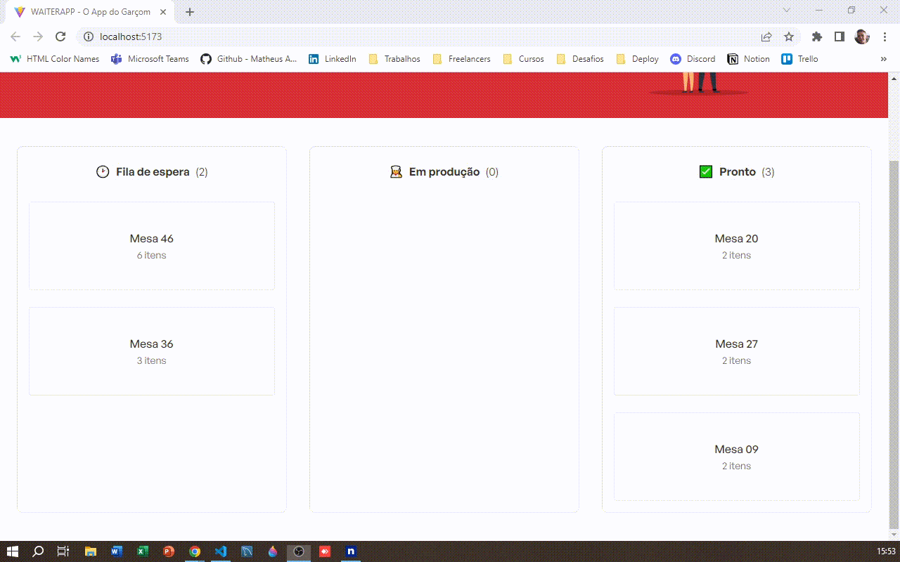

# WaiterApp

O projeto possui um app e um dashboard web que tem como função de modo geral realizarem o controle e preparo dos pedidos.

Seu objetivo é os garçons usarem o app para realizar as anotações dos pedidos dos clientes, onde instanteneamente através do WebSocket são enviados para o dashboard web para ser monitorados pelos chefes de cozinha podendo visualizar os detalhes do pedido, bem como alterar seus status conforme vão progredindo no preparo do prato.

## Funcionalidades

#### Cozinheiros(as)
- Ver detalhes do pedido realizado
- Cancelar pedidos
- Mudar status dos pedidos

#### Garçons/Garçonetes
- Registro de pedidos com o número da mesa
- Visualizar detalhes dos produtos
- Adição/remoção de produtos do carrinho
- Cancelar pedido antes de confirmar

## Stacks utilizadas

**Front-end:** React, Styled-Components, React-Toastify, Axios e Socket.io (Websocket para monitorar a entrada e mudança de status dos pedidos);

**Back-end:** Node, Express, MongoDB, Socket.io e Multer (upload de fotos);

**Mobile:** React-Native, Expo, Axios e Styled-Components.

## Rodando localmente

Clone o projeto

```bash
  git clone https://github.com/Matheus2004a/waiter-app.git
```

### Rodando a API e o Front-End

Entre no diretório da API

```bash
  cd waiter-app/api
```

Instale as dependências

```bash
  npm install
```

Inicie o servidor

```bash
  npm run dev
```

Entre no diretório do Front-End

```bash
  cd waiter-app/fe
```

Instale as dependências
```bash
  npm install
```

Inicie o servidor

```bash
  npm run dev
```

### Rodando o app

Entre no diretório mobile

```bash
  cd waiter-app/mobile
```

Instale as dependências
```bash
  npm install
```

Inicie o servidor

```bash
  npm start
```

- Escaneie o QRCode gerado;
- Ou clique no link *exp://192.168.15.2:19000* no app Expo

### Requisições a API no app

Ao utilizar o aplicativo do Expo ele conta com seu próprio localhost, então terá de usar um software como o **Ngrok** que expõe as portas do seu computador para que os clientes possam consumir serviços que estejam rodando em algumas delas. Para isso rode o comando abaixo:

```bash
  npx expo start --tunnel
```

Caso não tenha o **Ngrok** instalado na sua máquina rode o comando abaixo:

```bash
  npm i -g @expo/ngrok
```

Para mais detalhades consulte a doc oficial do Expo: https://docs.expo.dev/more/expo-cli
## Documentação da API

### Categorias

#### Retorna todas as categorias cadastradas

```http
  GET /categories
```

#### Retorna todos os produtos de uma categoria

```http
  GET /categories/${id}/products
```

| Parâmetro   | Tipo       | Descrição                                   |
| :---------- | :--------- | :------------------------------------------ |
| `id`      | `string` | **Obrigatório**. O ID da categoria |

#### Cria uma nova categoria

```http
  POST /categories

  {
    "icon": "🏷",
    "name": "Promoções"
  }
```

| Parâmetro   | Tipo       | Descrição                                   |
| :---------- | :--------- | :------------------------------------------ |
| `icon`      | `string` | **Obrigatório**. Ícone da categoria |
| `name`      | `string` | **Obrigatório**. Nome da categoria |

#### Atualiza uma categoria

```http
  PUT /categories/${id}

  {
    "icon": "🏷",
    "name": "Promoções"
  }
```

| Parâmetro   | Tipo       | Descrição                                   |
| :---------- | :--------- | :------------------------------------------ |
| `id`      | `string` | **Obrigatório**. ID da categoria |
| `icon`      | `string` | **Obrigatório**. Novo ícone da categoria |
| `name`      | `string` | **Obrigatório**. Novo nome da categoria |

### Produtos

#### Retorna todos os produtos cadastrados

```http
  GET /products
```

#### Cria um novo produto

```http
  POST /products
  Content-Type: multipart/form-data

  {
    "name": "Chop - Skol"
    "description": "Venha saborear este refrescante chop",
    "price": 6.99,
    "price": 6.99,
    "category": "648c694fec6e9641249692a6",
    "imagePath": "cerveja.png",
  }
```

| Parâmetro   | Tipo       | Descrição                                   |
| :---------- | :--------- | :------------------------------------------ |
| `name`      | `string` | **Obrigatório**. Nome do produto |
| `description`      | `string` | **Obrigatório**. Descrição com mais informações do produto |
| `price`      | `number` | **Obrigatório**. Preço do produto |
| `category`      | `string` | **Obrigatório**. ID da categoria do produto |
| `imagePath`      | `string` | **Obrigatório**. Caminho/Diretório da foto do produto |

### Pedidos

#### Retorna todos os pedidos cadastrados

```http
  GET /orders
```

#### Cria um novo pedido

```http
  POST /orders

  {
    "table": "3",
    "products": [
      {
        "product": "6483ec573accb32bfdea84dd",
        "quantity": 1
      },
      {
        "product": "6483f15d8fa9b4d3861b7153",
        "quantity": 1
      }
    ] 
  }
```

| Parâmetro   | Tipo       | Descrição                                   |
| :---------- | :--------- | :------------------------------------------ |
| `table`      | `string` | **Obrigatório**. Número da mesa que fez o pedido |
| `products`      | `array` | **Obrigatório**. Recebe uma lista de produtos |
| `product`      | `string` | **Obrigatório**. ID do produto |
| `quantity`      | `number` | **Obrigatório**. Quantidade do produto |

#### Atualiza o status do pedido

```http
  PATCH /orders/${id}

  {
    "status": "IN_PRODUCTION"
  }
```

| Parâmetro   | Tipo       | Descrição                                   |
| :---------- | :--------- | :------------------------------------------ |
| `id`      | `string` | **Obrigatório**. ID do pedido |
| `status`      | `string` | **Obrigatório**. Status do pedido |

#### Cancela/deleta um pedido

```http
  DELETE /orders/${id}
```

| Parâmetro   | Tipo       | Descrição                                   |
| :---------- | :--------- | :------------------------------------------ |
| `id`      | `string` | **Obrigatório**. ID do pedido |


## Variáveis de Ambiente

Para rodar a API desse projeto, você vai precisar adicionar as seguintes variáveis de ambiente no arquivo .env dentro da pasta `api`

`DATABASE_URL`
`PORT`


## Screenshots



